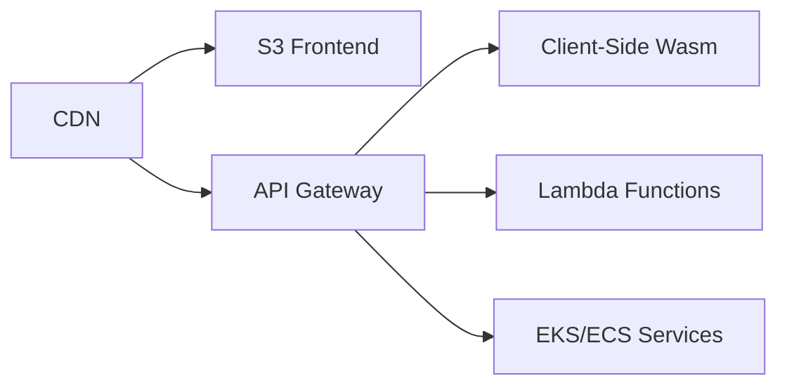

# Template 5 - High-Performance AI & PDF Platform

Template 5 is a robust, full-stack application template designed for ultra-low latency, scalable cloud-native architectures. This project features a state-of-the-art PDF management tool suite built with a **Client-Side First** philosophy.

## 🚀 Key Features

*   **Advanced PDF Suite:** Visual Organize, Merge, Split, and Compress PDF tools.
*   **Privacy-First Design:** All document processing occurs in the browser using `pdf-lib` and `pdf.js`.
*   **AI Integration:** Optimized for AI-assisted document workflows (OCR, translation - incoming).
*   **Cloud-Native Hosting:** Architected for deployment on AWS/Cloudflare (CDN + S3 + Lambda).

## 🛠 Project Structure

- `frontend/`: React + Vite application with Tailwind CSS and Framer Motion.
- `backend/`: Django/Python backend for heavy processing and data management. (Service tier).
- `SYSTEM_ARCHITECTURE.md`: Deep dive into the cloud infrastructure and data flow.
- `docker-compose.yml`: Local Development environment using standard containers (MySQL, Django, Vite).

## 🏗 System Architecture

For a detailed look at the cloud-native design, see our [SYSTEM_ARCHITECTURE.md](./SYSTEM_ARCHITECTURE.md).



## 💻 Local Development

1. **Clone the repository.**
2. **Start the local infrastructure with Docker:**
   ```bash
   docker-compose up --build
   ```
3. **Frontend Development:**
   ```bash
   cd frontend
   npm install
   npm run dev
   ```
4. **Backend Development:**
   ```bash
   cd backend
   pip install -r requirements.txt
   python manage.py runserver
   ```

## ☁️ Deployment Philosophy

This project aims for a zero-server approach for document processing (via WebAssembly/JS) and a serverless-focused backend to minimize maintenance and maximize scalability.

---
*Developed for Template development - Template 5*
