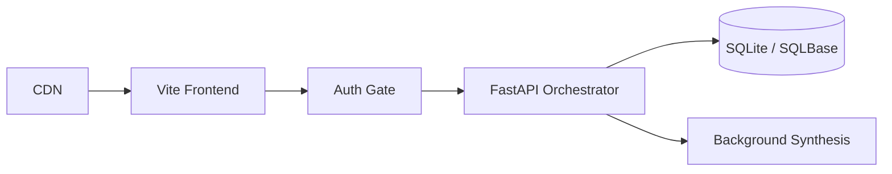

# Aura Platform - High-Performance AI & Orchestration Hub

Aura Platform is a robust, full-stack application template designed for ultra-low latency, scalable cloud-native architectures. This project features a state-of-the-art PDF management tool suite, generative AI integrations, and a deeply optimized developer console.

## 🚀 Key Features
*   **Aura Command Hub:** Visual Organize, Merge, Split, and Compress PDF tools directly integrated with frontend/backend orchestration.
*   **Privacy-First Design:** Sensitive document processing offloaded to the browser, with heavy-lifting capabilities structured on the backend.
*   **AI Integration:** Framework set up for AI-assisted workflows (Neural synthesis, voice generation).
*   **Premium "Button-Card" Aesthetics:** Deep glassmorphism, dynamic lighting, and a modern 'Studio' application feel.

## 🛠 Project Structure

- `frontend/`: React + Vite application boasting Framer Motion liquid physics and an immersive dark mode theme.
- `backend/`: FastAPI + SQLAlchemy backend serving as the hyper-fast capability engine.
- `SYSTEM_ARCHITECTURE.md`: Deep dive into the cloud infrastructure and intended data flow.
- `aura_platform.db`: The provisioned SQLite backend database driving features and live telemetry.

---
## 📂 Full File & Directory Arrangement


### Root Directory
- `analytics_stats.json`, `audio_names.json`, `audio_tools.json`, `image_tools.json`, `video_tools.json`: JSON data/configuration for analytics and tool definitions.
- `platform_schema.sql`: SQL schema for the platform database.
- `docker-compose.yml`, `Dockerfile`: Docker configuration for deployment.
- `README.md`: Main project documentation (this file).
- `SYSTEM_ARCHITECTURE.md`: High-level system architecture and infrastructure design.

### backend/
- `README.md`: Backend-specific documentation and usage.
- `requirements.txt`: Python dependencies for backend.
- `init_db.py`: Script to initialize and seed the database.
- `main.py`: FastAPI application entry point.
- `core/`
   - `db.py`: Sets up the SQLAlchemy database engine, session, and base class for models.
   - `__init__.py`: Marks the folder as a Python package.
- `api/`
   - `models/`
      - `database_models.py`: SQLAlchemy ORM classes for database tables (Platform, PlatformStat, PlatformCapability).
      - `__init__.py`: Marks the folder as a Python package.
   - `routes/`
      - `assets.py`: FastAPI routes for file and asset management (upload, fetch, list). Handles file uploads and database registration for assets.
      - `pdf.py`: API endpoints for PDF-related operations (merge, split, compress, etc.).
      - `profile.py`: Endpoints for user profile management.
      - `__init__.py`: Marks the folder as a Python package.
   - `services/`
      - `analytics_service.py`: Functions for analytics/statistics, such as loading and updating usage stats, and recording activity.
      - `pdf_service.py`: Business logic for PDF operations.
      - `__init__.py`: Marks the folder as a Python package.

### frontend/
- `README.md`: Frontend-specific documentation and usage.
- `package.json`: NPM dependencies and scripts.
- `vite.config.js`: Vite build configuration.
- `public/`: Static assets (images, icons, etc.).
- `src/`
   - `App.jsx`, `main.jsx`: Application entry points.
   - `assets/`: Static assets used in the app.
   - `components/`
      - `Button.jsx`: Reusable button component with glassmorphic style.
      - `Navbar.jsx`: Main navigation bar with icon-based tabs.
      - `CreditErrorMessage.jsx`, `ErrorBoundary.jsx`, `RightSettingsPanel.jsx`, `Sidebar.jsx`, `Toolbar.jsx`: UI components for error handling, settings, navigation, and toolbars.
      - `buttons/`: Contains button variants (PrimaryButton.jsx, SecondaryButton.jsx, etc.).
      - `common/`: Shared UI elements (toggles, rails, trays).
      - `dropdowns/`: Dropdown menu components.
      - `layouts/`: Layout wrappers for tools/pages.
      - `sidebars/`: Sidebar components for different tool categories.
      - `toolSettings/`: Settings panels for PDF and other tools.
   - `constants/`: Static configuration and data arrays.
   - `context/`: React context providers for state management.
   - `features/`
      - `pdf/`: Contains specialized PDF tool features (e.g., PDF merger, extractor, etc.).
   - `pages/`
      - `DashboardPage.jsx`, `Login.jsx`, `Profile.jsx`, `Register.jsx`, `SettingsLegacy.jsx`, `SidebarPage.jsx`, `ToolbarPage.jsx`: Main page components.
      - `about-us/`, `avatar/`, `dashboards/`, `developers/`, `files/`, `image/`, `intelligence/`, `marketing/`, `pdf/`, `profile/`, `profile_sub/`, `settings/`, `social-media/`, `speech/`, `studio/`, `text/`: Subfolders for feature-specific or section-specific pages.
   - `services/`
      - `api.js`: API service for backend communication.
      - `providerService.js`: Service for provider logic.
      - `index.js`: Service index.
   - `styles/`
      - `App.css`, `Navbar.css`, `Button.css`, `Sidebar.css`, `Toolbar.css`, `theme.css`, etc.: Global and component-specific CSS.
      - `pages/`: Page-specific CSS (e.g., Settings.css).
   - `utils/`: Utility/helper functions for the frontend.

### docs/
- `README.md`, `SYSTEM_ARCHITECTURE.md`: Documentation files, moved here for better organization.

---
Each folder contains a README or index file where possible, and the code is modularized for scalability and clarity. For more granular details, see the respective README or ask for a file-by-file breakdown of any folder.

---
## 📄 File-by-File Breakdown

### Project Root
- `.git/`, `.github/`, `.venv/`, `.vscode/`: Git, GitHub, Python virtual environment, and VS Code config folders.
- `analytics_stats.json`, `audio_names.json`, `audio_tools.json`, `image_tools.json`, `video_tools.json`: JSON data/configuration for analytics and tool definitions.
- `aura_platform.db`: SQLite database file.
- `backend/`: Backend (FastAPI) source code.
- `database/`: SQL schema or migration files.
- `dev.ps1`: PowerShell script for development setup.
- `docker/`: Docker-related files (Dockerfile, docker-compose.yml, etc.).
- `docker-compose.yml`, `Dockerfile`: Docker configuration for the project.
- `docs/`: Documentation files.
- `frontend/`: Frontend (React) source code.
- `platform_schema.sql`: SQL schema for the platform database.
- `README.md`: Main project documentation.
- `scripts/`: Utility scripts for development or deployment.
- `SYSTEM_ARCHITECTURE.md`: High-level system architecture and infrastructure design.
- `tmp/`: Temporary files.

### backend/
- `api/`: Main API logic (models, routes, services).
- `core/`: Database configuration and global backend settings.
- `init_db.py`: Script to initialize and seed the database.
- `main.py`: FastAPI application entry point.
- `README.md`: Backend-specific documentation.
- `requirements.txt`: Python dependencies for backend.
- `__init__.py`: Marks the folder as a Python package.
- `__pycache__/`: Python bytecode cache.

#### backend/api/
- `models/`: SQLAlchemy ORM models.
- `routes/`: FastAPI route definitions.
- `services/`: Business logic and service layers.
- `__init__.py`: Marks the folder as a Python package.
- `__pycache__/`: Python bytecode cache.

##### backend/api/models/
- `database_models.py`: SQLAlchemy ORM classes for database tables (Platform, PlatformStat, PlatformCapability).
- `__init__.py`: Marks the folder as a Python package.
- `__pycache__/`: Python bytecode cache.

##### backend/api/routes/
- `assets.py`: FastAPI routes for file and asset management.
- `pdf.py`: API endpoints for PDF-related operations.
- `profile.py`: Endpoints for user profile management.
- `__init__.py`: Marks the folder as a Python package.
- `__pycache__/`: Python bytecode cache.

##### backend/api/services/
- `analytics_service.py`: Functions for analytics/statistics and activity recording.
- `pdf_service.py`: Business logic for PDF operations.
- `__init__.py`: Marks the folder as a Python package.
- `__pycache__/`: Python bytecode cache.

#### backend/core/
- `db.py`: Sets up the SQLAlchemy database engine, session, and base class for models.
- `__init__.py`: Marks the folder as a Python package.
- `__pycache__/`: Python bytecode cache.

### frontend/
- `.gitignore`: Git ignore file for frontend.
- `build_err.txt`, `build_log.txt`, `build_log_2.txt`: Build logs and errors.
- `dist/`: Production build output.
- `Dockerfile`: Docker configuration for frontend.
- `eslint.config.js`: ESLint configuration.
- `fix_kebab.cjs`: Script for kebab-case fixes.
- `index.html`: Main HTML file for the React app.
- `node_modules/`: NPM dependencies.
- `package-lock.json`, `package.json`: NPM lock file and package manifest.
- `public/`: Static assets (images, icons, etc.).
- `README.md`: Frontend-specific documentation.
- `src/`: Main source code for the React app.
- `tmp/`: Temporary files.
- `update_routes.cjs`, `update_sidebar.cjs`: Scripts for updating routes/sidebar.
- `vite.config.js`: Vite build configuration.

#### frontend/src/
- `App.css`, `index.css`: Global CSS.
- `App.jsx`, `main.jsx`: Application entry points.
- `assets/`: Static assets used in the app (hero.png, react.svg, vite.svg).
- `components/`: Reusable UI components (see below for subfolders).
- `constants/`: Static configuration and data arrays (dashboardConfig.js, data.js, sidebarData.js).
- `context/`: React context providers for state management (NotificationContext.jsx, SettingsContext.jsx, TaskContext.jsx, ThemeContext.jsx).
- `features/`: Specialized tool features (e.g., pdf/).
- `pages/`: Page-level components and routing (many subfolders and files).
- `services/`: API and provider service logic (api.js, providerService.js, index.js).
- `styles/`: CSS files for global and component-specific styles (many subfolders and files).
- `utils/`: Utility/helper functions for the frontend (api.js, pdfCompress.js, etc.).

##### frontend/src/components/
- `Button.jsx`: Reusable button component with glassmorphic style.
- `CreditErrorMessage.jsx`, `ErrorBoundary.jsx`, `RightSettingsPanel.jsx`, `Sidebar.jsx`, `Toolbar.jsx`, `Navbar.jsx`, etc.: UI components for error handling, settings, navigation, and toolbars.
- `buttons/`: Button variants (BaseButton.jsx, DangerButton.jsx, GhostButton.jsx, OutlineButton.jsx, PrimaryButton.jsx, SecondaryButton.jsx, SuccessButton.jsx, index.js).
- `common/`: Shared UI elements (NextActionRail.jsx, OnOffButton.css, OnOffButton.jsx, Toggle.css, Toggle.jsx, VisualAssetTray.jsx).
- `dropdowns/`: Dropdown menu components (Dropdown.jsx, DropdownDivider.jsx, DropdownItem.jsx, PDFToolSwitcher.jsx, SidebarCategorySwitcher.jsx, index.js).
- `layouts/`: Layout wrappers for tools/pages (ToolLayout.css, ToolLayout.jsx).
- `sidebars/`: Sidebar components for different tool categories (AudioConversionSidebar.jsx, ConvertFromPDFSidebar.jsx, ConvertToPDFSidebar.jsx, DocumentConversionSidebar.jsx, EbookConversionSidebar.jsx, EditPDFSidebar.jsx, ImageFormatConversionSidebar.jsx, OfficeToolsSidebar.jsx, OptimizePDFSidebar.jsx, OrganizePDFSidebar.jsx, PDFIntelligenceSidebar.jsx, PDFSecuritySidebar.jsx, VideoConversionSidebar.jsx).
- `toolSettings/`: Settings panels for PDF and other tools (ExtractPagesSettings.jsx, MergePDFSettings.jsx, OrganizePDFSettings.jsx, RemovePagesSettings.jsx, ScanToPDFSettings.jsx, SplitPDFSettings.jsx, ToolSettingsPanel.css, ToolSettingsPanel.jsx, index.js).

##### frontend/src/features/
- `pdf/`: Specialized PDF tool features (FAQSection.css, FAQSection.jsx, MinimalistPDFMerger.jsx, PDFMergerTool.jsx, usePDF.js).

##### frontend/src/pages/
- `DashboardPage.jsx`, `Login.jsx`, `Profile.jsx`, `Register.jsx`, `SettingsLegacy.jsx`, `SidebarPage.jsx`, `ToolbarPage.jsx`: Main page components.
- `about-us/`, `avatar/`, `dashboards/`, `developers/`, `files/`, `image/`, `intelligence/`, `marketing/`, `pdf/`, `profile/`, `profile_sub/`, `settings/`, `social-media/`, `speech/`, `studio/`, `text/`: Subfolders for feature-specific or section-specific pages. Each contains related page components and logic.

##### frontend/src/services/
- `api.js`: API service for backend communication.
- `providerService.js`: Service for provider logic.
- `index.js`: Service index.

##### frontend/src/styles/
- `App.css`, `Navbar.css`, `Button.css`, `Sidebar.css`, `Toolbar.css`, `theme.css`, etc.: Global and component-specific CSS.
- `pages/`: Page-specific CSS (e.g., Settings.css).

##### frontend/src/utils/
- `api.js`, `pdfCompress.js`, `pdfConvert.js`, `pdfConverter.js`, `pdfIntelligence.js`, `pdfMerge.js`, `pdfOptimizer.js`, `pdfSecurity.js`, `PDFThumbnailService.js`: Utility/helper functions for the frontend.

## 🏗 System Architecture



## 💻 Local Development

1. **Clone the repository.**
2. **Frontend Development:**
   ```bash
   cd frontend
   npm install
   npm run dev
   ```
3. **Backend Development:**
   Navigate back to the project root:
   ```bash
   pip install -r backend/requirements.txt
   python -m backend.init_db
   python -m uvicorn backend.main:app --reload --port 8000
   ```
   *Your live API Documentation will be hosted at `/docs`!*

## ☁️ Deployment Philosophy
This project currently acts as an extensible monolithic template. In production, the FastAPI core can separate into modular serverless functions while the React application pushes instantly via Cloudflare Pages or AWS Amplify.

---
*Developed as the high-fidelity Aura template*
