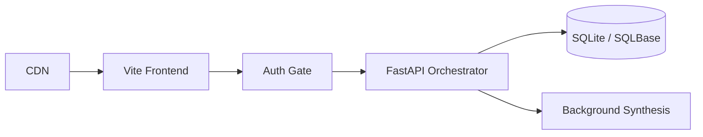

# Aura Platform - High-Performance AI & Orchestration Hub

Aura Platform is a robust, full-stack application template designed for ultra-low latency, scalable cloud-native architectures. This project features a state-of-the-art PDF management tool suite, generative AI integrations, and a deeply optimized developer console.

## 🚀 Key Features
*   **Aura Command Hub:** Visual Organize, Merge, Split, and Compress PDF tools directly integrated with frontend/backend orchestration.
*   **Privacy-First Design:** Sensitive document processing offloaded to the browser, with heavy-lifting capabilities structured on the backend.
*   **AI Integration:** Framework set up for AI-assisted workflows (Neural synthesis, voice generation).
*   **Premium "Button-Card" Aesthetics:** Deep glassmorphism, dynamic lighting, and a modern 'Studio' application feel.

## 🛠 Project Structure
- `frontend/`: React + Vite application boasting Framer Motion liquid physics and an immersive dark mode theme.
- `backend/`: FastAPI + SQLAlchemy backend serving as the hyper-fast capability engine.
- `SYSTEM_ARCHITECTURE.md`: Deep dive into the cloud infrastructure and intended data flow.
- `aura_platform.db`: The provisioned SQLite backend database driving features and live telemetry.

## 🏗 System Architecture



## 💻 Local Development

1. **Clone the repository.**
2. **Frontend Development:**
   ```bash
   cd frontend
   npm install
   npm run dev
   ```
3. **Backend Development:**
   Navigate back to the project root:
   ```bash
   pip install -r backend/requirements.txt
   python -m backend.init_db
   python -m uvicorn backend.main:app --reload --port 8000
   ```
   *Your live API Documentation will be hosted at `/docs`!*

## ☁️ Deployment Philosophy
This project currently acts as an extensible monolithic template. In production, the FastAPI core can separate into modular serverless functions while the React application pushes instantly via Cloudflare Pages or AWS Amplify.

---
*Developed as the high-fidelity Aura template*
